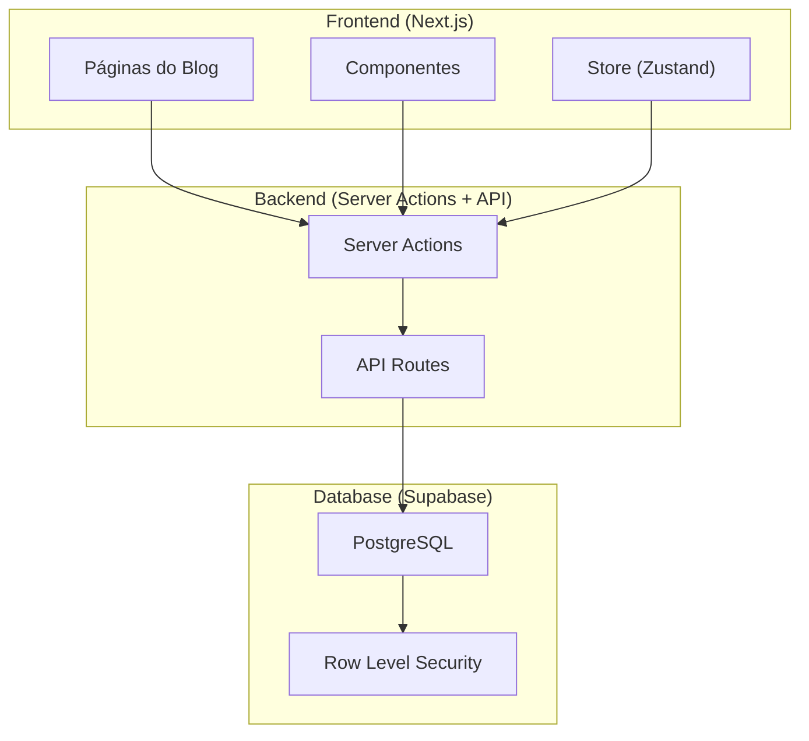
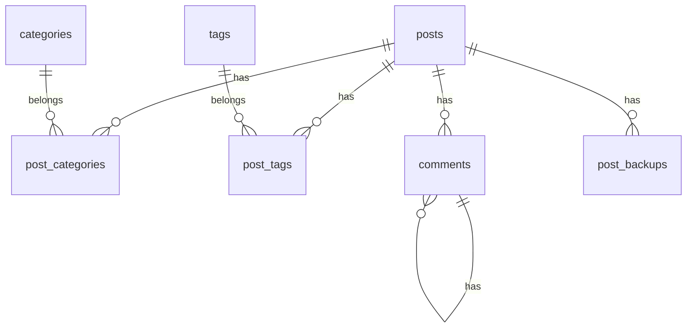

# Plano de Implementação - Seção de Blog

## 1. Análise do Projeto Atual

### 1.1 Stack Tecnológica

| Tecnologia       | Versão  | Propósito                        |
| ---------------- | ------- | -------------------------------- |
| **Next.js**      | 16.1.6  | Framework React com App Router   |
| **React**        | 19.2.4  | Biblioteca de UI                 |
| **Supabase**     | 2.97.0  | Banco de dados PostgreSQL + Auth |
| **Tailwind CSS** | 4.2.0   | Framework de estilização         |
| **Zustand**      | 5.0.11  | Gerenciamento de estado          |
| **Zod**          | 4.3.6   | Validação de dados               |
| **MercadoPago**  | 2.12.0  | Sistema de pagamentos            |
| **date-fns**     | 4.1.0   | Manipulação de datas             |
| **Lucide React** | 0.575.0 | Ícones                           |
| **Sonner**       | 2.0.7   | Notificações toast               |
| **shadcn/ui**    | 3.8.5   | Componentes UI baseados em Radix |

### 1.2 Padrões de Projeto Utilizados

1. **Server Actions** - Para mutations no servidor
2. **Service Layer** - [`src/services/productsService.ts`](src/services/productsService.ts) isola lógica de banco
3. **Cache Tags** - Next.js cache com tags para revalidação
4. **Zustand + Persist** - Estado global com persistência local
5. **Composição de Componentes** - Componentes funcionais com memo
6. **Supabase Auth Helpers** - Integração com Next.js App Router

### 1.3 Estrutura de Diretórios

```
src/
├── app/                    # App Router do Next.js
│   ├── api/               # API Routes (Serverless functions)
│   ├── admin/              # Painel administrativo
│   ├── cardapio/          # Catálogo de produtos
│   └── ...
├── components/             # Componentes React
│   ├── ui/                # Componentes shadcn/ui
│   ├── product-card/      # Componentes específicos
│   └── ...
├── services/              # Camada de serviços
├── store/                 # Zustand stores
├── hooks/                 # Custom hooks
├── lib/                   # Utilitários
└── types/                 # TypeScript definitions
```

### 1.4 Banco de Dados Atual

**Tabelas existentes:**

- `produtos` - Catálogo de produtos
- `pedidos` - Pedidos de clientes
- `admins` - Usuários administrativos

---

## 2. Arquitetura do Blog

### 2.1 Visão Geral



### 2.2 Estrutura de Dados do Blog



---

## 3. Plano de Implementação

### Fase 1: Banco de Dados

#### 3.1 Tabelas do Blog

```sql
-- Tabela principal de posts
CREATE TABLE public.posts (
    id UUID PRIMARY KEY DEFAULT gen_random_uuid(),
    title VARCHAR(255) NOT NULL,
    slug VARCHAR(255) UNIQUE NOT NULL,
    content TEXT NOT NULL,
    excerpt TEXT,
    cover_image TEXT,
    author_id UUID REFERENCES public.admins(id),
    status VARCHAR(20) DEFAULT 'draft', -- draft, scheduled, published, archived
    published_at TIMESTAMPTZ,
    scheduled_at TIMESTAMPTZ,
    view_count INTEGER DEFAULT 0,
    created_at TIMESTAMPTZ DEFAULT NOW(),
    updated_at TIMESTAMPTZ DEFAULT NOW()
);

-- Categorias
CREATE TABLE public.categories (
    id UUID PRIMARY KEY DEFAULT gen_random_uuid(),
    name VARCHAR(100) NOT NULL,
    slug VARCHAR(100) UNIQUE NOT NULL,
    description TEXT,
    color VARCHAR(7),
    created_at TIMESTAMPTZ DEFAULT NOW()
);

-- Tags
CREATE TABLE public.tags (
    id UUID PRIMARY KEY DEFAULT gen_random_uuid(),
    name VARCHAR(50) NOT NULL,
    slug VARCHAR(50) UNIQUE NOT NULL,
    created_at TIMESTAMPTZ DEFAULT NOW()
);

-- Relacionamento post-categoria (many-to-many)
CREATE TABLE public.post_categories (
    post_id UUID REFERENCES public.posts(id) ON DELETE CASCADE,
    category_id UUID REFERENCES public.categories(id) ON DELETE CASCADE,
    PRIMARY KEY (post_id, category_id)
);

-- Relacionamento post-tag (many-to-many)
CREATE TABLE public.post_tags (
    post_id UUID REFERENCES public.posts(id) ON DELETE CASCADE,
    tag_id UUID REFERENCES public.tags(id) ON DELETE CASCADE,
    PRIMARY KEY (post_id, tag_id)
);

-- Comentários
CREATE TABLE public.comments (
    id UUID PRIMARY KEY DEFAULT gen_random_uuid(),
    post_id UUID REFERENCES public.posts(id) ON DELETE CASCADE,
    parent_id UUID REFERENCES public.comments(id) ON DELETE CASCADE,
    author_name VARCHAR(100) NOT NULL,
    author_email VARCHAR(255) NOT NULL,
    content TEXT NOT NULL,
    status VARCHAR(20) DEFAULT 'pending', -- pending, approved, spam, deleted
    ip_address VARCHAR(45),
    user_agent TEXT,
    created_at TIMESTAMPTZ DEFAULT NOW()
);

-- Backups automáticos
CREATE TABLE public.post_backups (
    id UUID PRIMARY KEY DEFAULT gen_random_uuid(),
    post_id UUID REFERENCES public.posts(id) ON DELETE CASCADE,
    backup_data JSONB NOT NULL,
    created_at TIMESTAMPTZ DEFAULT NOW()
);

-- Índice para busca full-text
CREATE INDEX idx_posts_search ON public.posts USING gin(to_tsvector('portuguese', title || ' ' || content));

-- Índice para paginação
CREATE INDEX idx_posts_published ON public.posts(published_at DESC) WHERE status = 'published';

-- Índice para Slug
CREATE UNIQUE INDEX idx_posts_slug ON public.posts(slug);

-- Índices para categorias e tags
CREATE INDEX idx_post_categories_post ON public.post_categories(post_id);
CREATE INDEX idx_post_categories_category ON public.post_categories(category_id);
CREATE INDEX idx_post_tags_post ON public.post_tags(post_id);
CREATE INDEX idx_post_tags_tag ON public.post_tags(tag_id);
```

#### 3.2 Políticas RLS e Autenticação

```sql
-- ============================================
-- SEGURANÇA: POSTS
-- ============================================

-- Posts: leitura pública APENAS para publicados
CREATE POLICY "Posts publicados são públicos para leitura" ON public.posts
    FOR SELECT USING (status = 'published');

-- Admin pode ver todos os posts (incluindo drafts e agendados)
CREATE POLICY "Admins podem ver todos os posts" ON public.posts
    FOR SELECT USING (
        auth.uid() IN (SELECT id FROM admins)
    );

-- Apenas admins podem inserir/editar/deletar posts
CREATE POLICY "Admins podem gerenciar posts" ON public.posts
    FOR ALL USING (
        auth.uid() IN (SELECT id FROM admins)
    );

-- ============================================
-- SEGURANÇA: CATEGORIAS E TAGS
-- ============================================

-- Leitura pública
CREATE POLICY "Categorias públicas" ON public.categories FOR SELECT USING (true);
CREATE POLICY "Tags públicas" ON public.tags FOR SELECT USING (true);

-- Apenas admins podem modificar
CREATE POLICY "Admins gerenciam categorias" ON public.categories
    FOR ALL USING (auth.uid() IN (SELECT id FROM admins));

CREATE POLICY "Admins gerenciam tags" ON public.tags
    FOR ALL USING (auth.uid() IN (SELECT id FROM admins));

-- ============================================
-- SEGURANÇA: COMENTÁRIOS
-- ============================================

-- Leitura: público vê apenas aprovados
CREATE POLICY "Comentários aprovados são públicos" ON public.comments
    FOR SELECT USING (status = 'approved');

-- Admins podem ver todos para moderação
CREATE POLICY "Admins veem todos comentários" ON public.comments
    FOR SELECT USING (auth.uid() IN (SELECT id FROM admins));

-- Qualquer pessoa pode inserir comentário (sem auth necessária)
CREATE POLICY "Inserir comentários" ON public.comments
    FOR INSERT WITH CHECK (true);

-- Apenas admins podem editar status (moderar)
CREATE POLICY "Admins moderam comentários" ON public.comments
    FOR UPDATE USING (auth.uid() IN (SELECT id FROM admins));

-- ============================================
-- SEGURANÇA: POST_CATEGORIES E POST_TAGS
-- ============================================

CREATE POLICY "post_categories ler" ON public.post_categories FOR SELECT USING (true);
CREATE POLICY "post_categories admin" ON public.post_categories
    FOR ALL USING (auth.uid() IN (SELECT id FROM admins));

CREATE POLICY "post_tags ler" ON public.post_tags FOR SELECT USING (true);
CREATE POLICY "post_tags admin" ON public.post_tags
    FOR ALL USING (auth.uid() IN (SELECT id FROM admins));

-- ============================================
-- SEGURANÇA: BACKUPS
-- ============================================

-- Leitura apenas para admins
CREATE POLICY "Admins acessam backups" ON public.post_backups
    FOR ALL USING (auth.uid() IN (SELECT id FROM admins));
```

### Função Helper para Verificar Admin

```sql
-- Função para verificar se usuário é admin
CREATE OR REPLACE FUNCTION public.is_admin()
 RETURNS boolean
 LANGUAGE plpgsql
 SECURITY DEFINER
AS $
DECLARE
  user_id uuid;
BEGIN
  user_id := auth.uid();
  IF user_id IS NULL THEN
    RETURN false;
  END IF;
  RETURN EXISTS (
    SELECT 1 FROM admins WHERE id = user_id
  );
END;
$;
```

### Server Action com Verificação de Admin

````typescript
// src/lib/auth.ts - Função helper para verificar admin
import { createActionClient } from './supabase-server'

export async function requireBlogAdmin() {
  const supabase = await createActionClient()

  const { data: { user }, error } = await supabase.auth.getUser()

  if (error || !user) {
    throw new Error('Não autorizado - Faça login primeiro')
  }

  // Verificar se é admin
  const { data: admin } = await supabase
    .from('admins')
    .select('id')
    .eq('id', user.id)
    .single()

  if (!admin) {
    throw new Error('Acesso restrito - Apenas administradores')
  }

  return user
}

---

### Fase 2: Tipos TypeScript

#### 3.3 Tipos do Blog

```typescript
// src/types/blog.ts

export interface Post {
  id: string
  title: string
  slug: string
  content: string
  excerpt?: string
  cover_image?: string
  author_id: string
  status: 'draft' | 'scheduled' | 'published' | 'archived'
  published_at?: string
  scheduled_at?: string
  view_count: number
  created_at: string
  updated_at: string
  // Relations
  categories?: Category[]
  tags?: Tag[]
  author?: Admin
}

export interface PostWithRelations extends Post {
  categories: Category[]
  tags: Tag[]
  author: Admin
  comments: Comment[]
}

export interface Category {
  id: string
  name: string
  slug: string
  description?: string
  color?: string
  created_at: string
  post_count?: number
}

export interface Tag {
  id: string
  name: string
  slug: string
  created_at: string
  post_count?: number
}

export interface Comment {
  id: string
  post_id: string
  parent_id?: string
  author_name: string
  author_email: string
  content: string
  status: 'pending' | 'approved' | 'spam' | 'deleted'
  created_at: string
  replies?: Comment[]
}

export interface CreatePostInput {
  title: string
  slug?: string
  content: string
  excerpt?: string
  cover_image?: string
  category_ids?: string[]
  tag_ids?: string[]
  status?: 'draft' | 'scheduled' | 'published'
  scheduled_at?: string
}

export interface UpdatePostInput extends Partial<CreatePostInput> {
  id: string
}

export interface BlogSearchParams {
  page?: number
  limit?: number
  category?: string
  tag?: string
  search?: string
}

export interface PaginatedPosts {
  posts: Post[]
  total: number
  page: number
  limit: number
  totalPages: number
}
````

---

### Fase 3: Camada de Serviços

#### 3.4 Blog Service

```typescript
// src/services/blogService.ts
import { supabase } from '@/lib/supabase'
import { cacheTag } from 'next/cache'
import {
  Post,
  Category,
  Tag,
  Comment,
  CreatePostInput,
  UpdatePostInput,
  PaginatedPosts,
} from '@/types/blog'
import logger from '@/lib/logger'

const LOG_PREFIX = '[blog]'

export async function getCachedPosts(options: {
  page?: number
  limit?: number
  category?: string
  tag?: string
  search?: string
}): Promise<PaginatedPosts> {
  'use cache'
  cacheTag('blog-posts')

  const page = options.page || 1
  const limit = options.limit || 10
  const offset = (page - 1) * limit

  let query = supabase
    .from('posts')
    .select(
      `
      *,
      categories:post_categories(categories(*)),
      tags:post_tags(tags(*)),
      author:admins(*)
    `,
      { count: 'exact' }
    )
    .eq('status', 'published')
    .order('published_at', { ascending: false })
    .range(offset, offset + limit - 1)

  if (options.category) {
    query = query.eq('categories.categories.slug', options.category)
  }

  if (options.tag) {
    query = query.eq('tags.tags.slug', options.tag)
  }

  const { data, error, count } = await query

  if (error) {
    logger.error(`${LOG_PREFIX} getCachedPosts error`, { error: error.message })
    throw error
  }

  return {
    posts: data || [],
    total: count || 0,
    page,
    limit,
    totalPages: Math.ceil((count || 0) / limit),
  }
}

export async function getCachedPostBySlug(slug: string): Promise<Post | null> {
  'use cache'
  cacheTag('blog-post', slug)

  const { data, error } = await supabase
    .from('posts')
    .select(
      `
      *,
      categories:post_categories(categories(*)),
      tags:post_tags(tags(*)),
      author:admins(*)
    `
    )
    .eq('slug', slug)
    .eq('status', 'published')
    .single()

  if (error) {
    if (error.code === 'PGRST116') return null
    logger.error(`${LOG_PREFIX} getCachedPostBySlug error`, { slug, error: error.message })
    throw error
  }

  return data
}

export async function searchPosts(query: string, limit: number = 10): Promise<Post[]> {
  'use cache'
  cacheTag('blog-search', query)

  const { data, error } = await supabase
    .from('posts')
    .select(
      `
      *,
      categories:post_categories(categories(*)),
      tags:post_tags(tags(*))
    `
    )
    .eq('status', 'published')
    .or(`title.ilike.%${query}%,content.ilike.%${query}%`)
    .order('published_at', { ascending: false })
    .limit(limit)

  if (error) {
    logger.error(`${LOG_PREFIX} searchPosts error`, { query, error: error.message })
    throw error
  }

  return data || []
}

export class BlogService {
  async createPost(input: CreatePostInput): Promise<Post> {
    const slug = input.slug || this.generateSlug(input.title)

    const { data, error } = await supabase
      .from('posts')
      .insert({
        title: input.title,
        slug,
        content: input.content,
        excerpt: input.excerpt,
        cover_image: input.cover_image,
        status: input.status || 'draft',
        scheduled_at: input.scheduled_at,
      })
      .select()
      .single()

    if (error) throw error

    // Adicionar categorias
    if (input.category_ids?.length) {
      await supabase
        .from('post_categories')
        .insert(input.category_ids.map(catId => ({ post_id: data.id, category_id: catId })))
    }

    // Adicionar tags
    if (input.tag_ids?.length) {
      await supabase
        .from('post_tags')
        .insert(input.tag_ids.map(tagId => ({ post_id: data.id, tag_id: tagId })))
    }

    return data
  }

  async updatePost(input: UpdatePostInput): Promise<Post> {
    // Criar backup antes de atualizar
    const current = await this.getPostById(input.id)
    if (current) {
      await supabase.from('post_backups').insert({
        post_id: input.id,
        backup_data: current,
      })
    }

    const updates: Partial<Post> = {}
    if (input.title) updates.title = input.title
    if (input.content) updates.content = input.content
    if (input.excerpt !== undefined) updates.excerpt = input.excerpt
    if (input.cover_image !== undefined) updates.cover_image = input.cover_image
    if (input.status) updates.status = input.status
    if (input.scheduled_at) updates.scheduled_at = input.scheduled_at
    if (input.slug) updates.slug = input.slug

    const { data, error } = await supabase
      .from('posts')
      .update(updates)
      .eq('id', input.id)
      .select()
      .single()

    if (error) throw error

    // Atualizar categorias
    if (input.category_ids) {
      await supabase.from('post_categories').delete().eq('post_id', input.id)
      if (input.category_ids.length) {
        await supabase
          .from('post_categories')
          .insert(input.category_ids.map(catId => ({ post_id: input.id, category_id: catId })))
      }
    }

    // Atualizar tags
    if (input.tag_ids) {
      await supabase.from('post_tags').delete().eq('post_id', input.id)
      if (input.tag_ids.length) {
        await supabase
          .from('post_tags')
          .insert(input.tag_ids.map(tagId => ({ post_id: input.id, tag_id: tagId })))
      }
    }

    return data
  }

  async deletePost(id: string): Promise<boolean> {
    const { error } = await supabase.from('posts').delete().eq('id', id)
    if (error) throw error
    return true
  }

  async publishPost(id: string): Promise<Post> {
    return this.updatePost({ id, status: 'published', published_at: new Date().toISOString() })
  }

  async schedulePost(id: string, scheduledAt: string): Promise<Post> {
    return this.updatePost({ id, status: 'scheduled', scheduled_at: scheduledAt })
  }

  private generateSlug(title: string): string {
    return title
      .toLowerCase()
      .normalize('NFD')
      .replace(/[\u0300-\u036f]/g, '')
      .replace(/[^a-z0-9]+/g, '-')
      .replace(/(^-|-$)/g, '')
  }

  async getAllCategories(): Promise<Category[]> {
    const { data, error } = await supabase.from('categories').select('*').order('name')

    if (error) throw error
    return data || []
  }

  async getAllTags(): Promise<Tag[]> {
    const { data, error } = await supabase.from('tags').select('*').order('name')

    if (error) throw error
    return data || []
  }

  async getCommentsByPostId(postId: string): Promise<Comment[]> {
    const { data, error } = await supabase
      .from('comments')
      .select('*')
      .eq('post_id', postId)
      .eq('status', 'approved')
      .order('created_at', { ascending: true })

    if (error) throw error
    return data || []
  }

  async createComment(input: Omit<Comment, 'id' | 'created_at' | 'status'>): Promise<Comment> {
    const { data, error } = await supabase
      .from('comments')
      .insert({ ...input, status: 'pending' })
      .select()
      .single()

    if (error) throw error
    return data
  }

  async moderateComment(id: string, status: 'approved' | 'spam' | 'deleted'): Promise<Comment> {
    const { data, error } = await supabase
      .from('comments')
      .update({ status })
      .eq('id', id)
      .select()
      .single()

    if (error) throw error
    return data
  }
}
```

---

### Fase 4: Server Actions

#### 3.5 Actions do Blog

```typescript
// src/app/blog/actions.ts
'use server'

import { updateTag, revalidateTag } from 'next/cache'
import { requireAuthenticatedUser } from '@/lib/supabase-server'
import { BlogService } from '@/services/blogService'
import { CreatePostInput, UpdatePostInput } from '@/types/blog'
import logger from '@/lib/logger'

const service = new BlogService()
const LOG_PREFIX = '[blog:actions]'

export async function createPost(input: CreatePostInput) {
  const user = await requireAuthenticatedUser()
  logger.debug(`${LOG_PREFIX} createPost`, { title: input.title, userId: user.id })

  try {
    const result = await service.createPost(input)
    revalidateTag('blog-posts')
    revalidateTag('blog-categories')
    logger.info(`${LOG_PREFIX} post criado`, { postId: result.id })
    return result
  } catch (err) {
    logger.error(`${LOG_PREFIX} erro ao criar post`, { error: err })
    throw err
  }
}

export async function updatePost(input: UpdatePostInput) {
  const user = await requireAuthenticatedUser()
  logger.debug(`${LOG_PREFIX} updatePost`, { postId: input.id, userId: user.id })

  try {
    const result = await service.updatePost(input)
    revalidateTag('blog-posts')
    revalidateTag('blog-post', result.slug)
    logger.info(`${LOG_PREFIX} post atualizado`, { postId: input.id })
    return result
  } catch (err) {
    logger.error(`${LOG_PREFIX} erro ao atualizar post`, { error: err })
    throw err
  }
}

export async function deletePost(id: string) {
  const user = await requireAuthenticatedUser()
  logger.debug(`${LOG_PREFIX} deletePost`, { postId: id, userId: user.id })

  try {
    await service.deletePost(id)
    revalidateTag('blog-posts')
    logger.info(`${LOG_PREFIX} post deletado`, { postId: id })
    return true
  } catch (err) {
    logger.error(`${LOG_PREFIX} erro ao deletar post`, { error: err })
    throw err
  }
}

export async function publishPost(id: string) {
  const user = await requireAuthenticatedUser()
  try {
    const result = await service.publishPost(id)
    revalidateTag('blog-posts')
    revalidateTag('blog-post', result.slug)
    return result
  } catch (err) {
    logger.error(`${LOG_PREFIX} erro ao publicar post`, { error: err })
    throw err
  }
}

export async function schedulePost(id: string, scheduledAt: string) {
  const user = await requireAuthenticatedUser()
  try {
    const result = await service.schedulePost(id, scheduledAt)
    revalidateTag('blog-posts')
    return result
  } catch (err) {
    logger.error(`${LOG_PREFIX} erro ao agendar post`, { error: err })
    throw err
  }
}

export async function createCategory(name: string, description?: string, color?: string) {
  const user = await requireAuthenticatedUser()
  const slug = name
    .toLowerCase()
    .normalize('NFD')
    .replace(/[\u0300-\u036f]/g, '')
    .replace(/[^a-z0-9]+/g, '-')

  const { data, error } = await require('supabase')
    .from('categories')
    .insert({ name, slug, description, color })
    .select()
    .single()

  if (error) throw error
  revalidateTag('blog-categories')
  return data
}

export async function deleteCategory(id: string) {
  await requireAuthenticatedUser()
  const { error } = await supabase.from('categories').delete().eq('id', id)
  if (error) throw error
  revalidateTag('blog-categories')
  return true
}

export async function moderateComment(id: string, status: 'approved' | 'spam' | 'deleted') {
  await requireAuthenticatedUser()
  const result = await service.moderateComment(id, status)
  revalidateTag('blog-comments')
  return result
}

export async function createComment(input: {
  post_id: string
  author_name: string
  author_email: string
  content: string
  parent_id?: string
}) {
  try {
    const result = await service.createComment(input)
    return result
  } catch (err) {
    logger.error(`${LOG_PREFIX} erro ao criar comentário`, { error: err })
    throw err
  }
}
```

---

### Fase 5: Páginas do Blog

#### 3.6 Estrutura de Rotas

```
src/app/
├── blog/
│   ├── page.tsx                      # Listagem com paginação
│   ├── [slug]/
│   │   └── page.tsx                  # Artigo completo
│   ├── categoria/
│   │   └── [slug]/
│   │       └── page.tsx              # Posts por categoria
│   ├── tag/
│   │   └── [slug]/
│   │       └── page.tsx              # Posts por tag
│   ├── busca/
│   │   └── page.tsx                  # Busca
│   └── actions.ts                    # Server Actions
├── admin/
│   └── blog/
│       ├── page.tsx                  # Lista de posts
│       ├── novo/
│       │   └── page.tsx              # Criar post
│       ├── [id]/
│       │   └── edit/
│       │       └── page.tsx          # Editar post
│       ├── categorias/
│       │   └── page.tsx              # Gerenciar categorias
│       ├── comentarios/
│       │   └── page.tsx              # Moderação de comentários
│       └── actions.ts                # Server Actions admin
```

#### 3.7 Página Principal do Blog

```typescript
// src/app/blog/page.tsx
import { getCachedPosts } from '@/services/blogService'
import { PostCard } from '@/components/blog/PostCard'
import { Pagination } from '@/components/blog/Pagination'
import { BlogSearch } from '@/components/blog/BlogSearch'
import { BlogFilters } from '@/components/blog/BlogFilters'
import { Metadata } from 'next'

export const metadata: Metadata = {
  title: 'Blog - Afluar',
  description: 'Artigos sobre culinária amazônica, receitas, eventos e muito mais.',
  openGraph: {
    title: 'Blog - Afluar',
    description: 'Artigos sobre culinária amazônica.',
  }
}

interface PageProps {
  searchParams: Promise<{ page?: string; category?: string; tag?: string; search?: string }>
}

export default async function BlogPage({ searchParams }: PageProps) {
  const params = await searchParams
  const page = parseInt(params.page || '1')
  const category = params.category
  const tag = params.tag
  const search = params.search

  const { posts, total, totalPages } = await getCachedPosts({
    page,
    limit: 6,
    category,
    tag,
    search
  })

  return (
    <div className="container mx-auto max-w-6xl px-4 py-8">
      <header className="mb-12 text-center">
        <h1 className="text-4xl font-bold mb-4">Blog Afluar</h1>
        <p className="text-muted-foreground text-lg">
          Descubra receitas, eventos e cultura amazônica
        </p>
      </header>

      <BlogSearch />
      <BlogFilters />

      {posts.length === 0 ? (
        <div className="text-center py-12">
          <p className="text-muted-foreground">Nenhum post encontrado.</p>
        </div>
      ) : (
        <div className="grid grid-cols-1 md:grid-cols-2 lg:grid-cols-3 gap-8">
          {posts.map(post => (
            <PostCard key={post.id} post={post} />
          ))}
        </div>
      )}

      {totalPages > 1 && (
        <Pagination
          currentPage={page}
          totalPages={totalPages}
          baseUrl="/blog"
        />
      )}
    </div>
  )
}
```

#### 3.8 Página do Artigo

```typescript
// src/app/blog/[slug]/page.tsx
import { getCachedPostBySlug, getCachedPosts } from '@/services/blogService'
import { notFound } from 'next/navigation'
import Image from 'next/image'
import Link from 'next/link'
import { format } from 'date-fns'
import { ptBR } from 'date-fns/locale'
import { Metadata } from 'next'
import { CommentSection } from '@/components/blog/CommentSection'
import { ShareButtons } from '@/components/blog/ShareButtons'
import { RelatedPosts } from '@/components/blog/RelatedPosts'

interface PageProps {
  params: Promise<{ slug: string }>
}

export async function generateMetadata({ params }: PageProps): Promise<Metadata> {
  const { slug } = await params
  const post = await getCachedPostBySlug(slug)

  if (!post) return {}

  return {
    title: `${post.title} - Blog Afluar`,
    description: post.excerpt || post.content.slice(0, 160),
    openGraph: {
      title: post.title,
      description: post.excerpt || post.content.slice(0, 160),
      images: post.cover_image ? [{ url: post.cover_image }] : [],
      type: 'article',
      publishedTime: post.published_at,
      authors: [post.author?.nome || 'Afluar'],
    },
    twitter: {
      card: 'summary_large_image',
      title: post.title,
      description: post.excerpt || post.content.slice(0, 160),
      images: post.cover_image ? [post.cover_image] : [],
    }
  }
}

export default async function BlogPostPage({ params }: PageProps) {
  const { slug } = await params
  const post = await getCachedPostBySlug(slug)

  if (!post) {
    notFound()
  }

  // Incrementar visualizações
  await supabase.rpc('increment_post_views', { post_id: post.id })

  const { posts } = await getCachedPosts({ limit: 3, category: post.categories?.[0]?.slug })

  return (
    <article className="container mx-auto max-w-4xl px-4 py-8">
      <header className="mb-8">
        <div className="flex gap-2 mb-4">
          {post.categories?.map(cat => (
            <Link
              key={cat.id}
              href={`/blog/categoria/${cat.slug}`}
              className="text-sm font-medium text-primary hover:underline"
            >
              {cat.name}
            </Link>
          ))}
        </div>

        <h1 className="text-4xl md:text-5xl font-bold mb-4">{post.title}</h1>

        <div className="flex items-center gap-4 text-muted-foreground mb-6">
          <time dateTime={post.published_at}>
            {post.published_at && format(new Date(post.published_at), "d 'de' MMMM 'de' yyyy", { locale: ptBR })}
          </time>
          <span>•</span>
          <span>{post.view_count} visualizações</span>
        </div>

        {post.cover_image && (
          <div className="relative w-full h-100 mb-8 rounded-xl overflow-hidden">
            <Image
              src={post.cover_image}
              alt={post.title}
              fill
              className="object-cover"
              priority
            />
          </div>
        )}
      </header>

      <div className="prose prose-lg max-w-none mb-12">
        <div dangerouslySetInnerHTML={{ __html: post.content }} />
      </div>

      <div className="flex flex-wrap gap-2 mb-8">
        {post.tags?.map(tag => (
          <Link
            key={tag.id}
            href={`/blog/tag/${tag.slug}`}
            className="px-3 py-1 bg-secondary rounded-full text-sm hover:bg-secondary/80"
          >
            #{tag.name}
          </Link>
        ))}
      </div>

      <ShareButtons
        title={post.title}
        url={`/blog/${post.slug}`}
      />

      <hr className="my-12" />

      <CommentSection postId={post.id} />

      <RelatedPosts
        currentPostId={post.id}
        posts={posts.filter(p => p.id !== post.id).slice(0, 3)}
      />
    </article>
  )
}
```

---

### Fase 6: Componentes do Blog

#### 3.9 Componentes Principais

```typescript
// src/components/blog/PostCard.tsx
'use client'

import Link from 'next/link'
import Image from 'next/image'
import { format } from 'date-fns'
import { ptBR } from 'date-fns/locale'
import { Card, CardContent } from '@/components/ui/card'
import { Badge } from '@/components/ui/badge'
import { Post } from '@/types/blog'

interface PostCardProps {
  post: Post
}

export function PostCard({ post }: PostCardProps) {
  return (
    <Card className="overflow-hidden hover:shadow-lg transition-shadow">
      {post.cover_image && (
        <Link href={`/blog/${post.slug}`}>
          <div className="relative w-full h-48 bg-muted">
            <Image
              src={post.cover_image}
              alt={post.title}
              fill
              className="object-cover hover:scale-105 transition-transform duration-300"
              sizes="(max-width: 768px) 100vw, (max-width: 1200px) 50vw, 33vw"
            />
          </div>
        </Link>
      )}

      <CardContent className="p-4">
        <div className="flex gap-2 mb-2">
          {post.categories?.slice(0, 2).map(cat => (
            <Badge key={cat.id} variant="secondary" className="text-xs">
              {cat.name}
            </Badge>
          ))}
        </div>

        <Link href={`/blog/${post.slug}`}>
          <h2 className="text-xl font-bold mb-2 hover:text-primary transition-colors line-clamp-2">
            {post.title}
          </h2>
        </Link>

        {post.excerpt && (
          <p className="text-muted-foreground text-sm mb-3 line-clamp-3">
            {post.excerpt}
          </p>
        )}

        <div className="flex items-center gap-2 text-xs text-muted-foreground">
          <time dateTime={post.published_at}>
            {post.published_at && format(new Date(post.published_at), "d MMM", { locale: ptBR })}
          </time>
          <span>•</span>
          <span>{post.view_count} visualizações</span>
        </div>
      </CardContent>
    </Card>
  )
}
```

```typescript
// src/components/blog/CommentSection.tsx
'use client'

import { useState } from 'react'
import { Button } from '@/components/ui/button'
import { Input } from '@/components/ui/input'
import { Textarea } from '@/components/ui/textarea'
import { createComment } from '@/app/blog/actions'
import { useForm } from 'react-hook-form'
import { zodResolver } from '@hookform/resolvers/zod'
import { z } from 'zod'
import { toast } from 'sonner'

const commentSchema = z.object({
  author_name: z.string().min(2, 'Nome deve ter pelo menos 2 caracteres'),
  author_email: z.string().email('Email inválido'),
  content: z.string().min(5, 'Comentário deve ter pelo menos 5 caracteres')
})

type CommentFormData = z.infer<typeof commentSchema>

interface CommentSectionProps {
  postId: string
}

export function CommentSection({ postId }: CommentSectionProps) {
  const [isSubmitting, setIsSubmitting] = useState(false)
  const { register, handleSubmit, reset, formState: { errors } } = useForm<CommentFormData>({
    resolver: zodResolver(commentSchema)
  })

  const onSubmit = async (data: CommentFormData) => {
    setIsSubmitting(true)
    try {
      await createComment({ ...data, post_id: postId })
      toast.success('Comentário enviado! Aguarde moderação.')
      reset()
    } catch (error) {
      toast.error('Erro ao enviar comentário')
    } finally {
      setIsSubmitting(false)
    }
  }

  return (
    <section className="mt-12">
      <h2 className="text-2xl font-bold mb-6">Deixe seu comentário</h2>

      <form onSubmit={handleSubmit(onSubmit)} className="space-y-4 max-w-xl">
        <div className="grid grid-cols-2 gap-4">
          <div>
            <Input
              {...register('author_name')}
              placeholder="Seu nome"
              aria-label="Nome"
            />
            {errors.author_name && (
              <p className="text-sm text-destructive mt-1">{errors.author_name.message}</p>
            )}
          </div>
          <div>
            <Input
              {...register('author_email')}
              type="email"
              placeholder="Seu email"
              aria-label="Email"
            />
            {errors.author_email && (
              <p className="text-sm text-destructive mt-1">{errors.author_email.message}</p>
            )}
          </div>
        </div>

        <div>
          <Textarea
            {...register('content')}
            placeholder="Seu comentário..."
            rows={4}
            aria-label="Comentário"
          />
          {errors.content && (
            <p className="text-sm text-destructive mt-1">{errors.content.message}</p>
          )}
        </div>

        <Button type="submit" disabled={isSubmitting}>
          {isSubmitting ? 'Enviando...' : 'Enviar Comentário'}
        </Button>

        <p className="text-xs text-muted-foreground">
          Seu comentário será moderado antes de ser publicado.
        </p>
      </form>
    </section>
  )
}
```

```typescript
// src/components/blog/ShareButtons.tsx
'use client'

import { Button } from '@/components/ui/button'
import { Facebook, Twitter, Linkedin, Link2, Mail } from 'lucide-react'
import { useState } from 'react'

interface ShareButtonsProps {
  title: string
  url: string
}

export function ShareButtons({ title, url }: ShareButtonsProps) {
  const [copied, setCopied] = useState(false)
  const fullUrl = `https://afluar.com.br${url}`

  const shareLinks = {
    facebook: `https://www.facebook.com/sharer/sharer.php?u=${encodeURIComponent(fullUrl)}`,
    twitter: `https://twitter.com/intent/tweet?text=${encodeURIComponent(title)}&url=${encodeURIComponent(fullUrl)}`,
    linkedin: `https://www.linkedin.com/sharing/share-offsite/?url=${encodeURIComponent(fullUrl)}`,
    email: `mailto:?subject=${encodeURIComponent(title)}&body=${encodeURIComponent(fullUrl)}`
  }

  const copyToClipboard = async () => {
    await navigator.clipboard.writeText(fullUrl)
    setCopied(true)
    setTimeout(() => setCopied(false), 2000)
  }

  return (
    <div className="flex gap-2">
      <Button variant="outline" size="icon" asChild>
        <a href={shareLinks.facebook} target="_blank" rel="noopener noreferrer" aria-label="Compartilhar no Facebook">
          <Facebook className="w-4 h-4" />
        </a>
      </Button>

      <Button variant="outline" size="icon" asChild>
        <a href={shareLinks.twitter} target="_blank" rel="noopener noreferrer" aria-label="Compartilhar no Twitter">
          <Twitter className="w-4 h-4" />
        </a>
      </Button>

      <Button variant="outline" size="icon" asChild>
        <a href={shareLinks.linkedin} target="_blank" rel="noopener noreferrer" aria-label="Compartilhar no LinkedIn">
          <Linkedin className="w-4 h-4" />
        </a>
      </Button>

      <Button variant="outline" size="icon" asChild>
        <a href={shareLinks.email} aria-label="Compartilhar por Email">
          <Mail className="w-4 h-4" />
        </a>
      </Button>

      <Button variant="outline" size="icon" onClick={copyToClipboard} aria-label="Copiar link">
        {copied ? <span className="text-xs">Copiado!</span> : <Link2 className="w-4 h-4" />}
      </Button>
    </div>
  )
}
```

---

### Fase 7:SEO e Otimizações

#### 3.10 Sitemap do Blog

```typescript
// src/app/blog/sitemap.ts
import { MetadataRoute } from 'next'
import { BlogService } from '@/services/blogService'

export default async function sitemap(): Promise<MetadataRoute.Sitemap> {
  const baseUrl = 'https://afluar.com.br'
  const service = new BlogService()

  // Buscar posts publicados
  const posts = await service.getAllPublishedPosts()
  const categories = await service.getAllCategories()

  const postUrls = posts.map(post => ({
    url: `${baseUrl}/blog/${post.slug}`,
    lastModified: new Date(post.updated_at),
    changeFrequency: 'weekly' as const,
    priority: 0.8,
  }))

  const categoryUrls = categories.map(cat => ({
    url: `${baseUrl}/blog/categoria/${cat.slug}`,
    lastModified: new Date(),
    changeFrequency: 'weekly' as const,
    priority: 0.6,
  }))

  const routes = [
    { url: `${baseUrl}/blog`, priority: 1 },
    { url: `${baseUrl}/blog/busca`, priority: 0.5 },
  ].map(route => ({
    ...route,
    lastModified: new Date(),
    changeFrequency: 'daily' as const,
  }))

  return [...routes, ...postUrls, ...categoryUrls]
}
```

#### 3.11 Robots.txt Atualizado

```typescript
// src/app/robots.ts (atualizar)
export default function robots(): MetadataRoute.Robots {
  return {
    rules: {
      userAgent: '*',
      allow: '/',
      disallow: ['/admin/', '/api/'],
    },
    sitemap: 'https://afluar.com.br/sitemap.xml',
  }
}
```

---

### Fase 8: Sistema de Backup Automático

#### 3.12 Função de Backup

```sql
-- Função para criar backup automático antes de updates
CREATE OR REPLACE FUNCTION public.auto_backup_post()
 RETURNS trigger
 LANGUAGE plpgsql
AS $function$
BEGIN
  IF OLD IS NOT NULL AND OLD.status = 'published' THEN
    INSERT INTO post_backups (post_id, backup_data)
    VALUES (OLD.id, to_jsonb(OLD));
  END IF;
  RETURN NEW;
END;
$function$;

-- Trigger
CREATE TRIGGER posts_auto_backup
  BEFORE UPDATE ON public.posts
  FOR EACH ROW
  EXECUTE FUNCTION public.auto_backup_post();
```

---

## 4. Lista de Tarefas de Implementação

### Fase 1: Banco de Dados

- [ ] Criar tabela `posts` com todos os campos
- [ ] Criar tabela `categories`
- [ ] Criar tabela `tags`
- [ ] Criar tabela `post_categories` (many-to-many)
- [ ] Criar tabela `post_tags` (many-to-many)
- [ ] Criar tabela `comments`
- [ ] Criar tabela `post_backups`
- [ ] Criar índices para performance
- [ ] Configurar políticas RLS
- [ ] Criar função de auto-backup

### Fase 2: Backend

- [ ] Criar tipos TypeScript em `src/types/blog.ts`
- [ ] Criar `BlogService` em `src/services/blogService.ts`
- [ ] Implementar cache com tags
- [ ] Criar Server Actions em `src/app/blog/actions.ts`

### Fase 3: Frontend - Páginas Públicas

- [ ] Criar página `/blog` com listagem e paginação
- [ ] Criar página `/blog/[slug]` para artigos
- [ ] Criar página `/blog/categoria/[slug]`
- [ ] Criar página `/blog/tag/[slug]`
- [ ] Criar página `/blog/busca`
- [ ] Implementar SEO dinâmico (metadata)

### Fase 4: Frontend - Componentes

- [ ] Criar componente `PostCard`
- [ ] Criar componente `CommentSection`
- [ ] Criar componente `ShareButtons`
- [ ] Criar componente `Pagination`
- [ ] Criar componente `BlogSearch`
- [ ] Criar componente `BlogFilters`
- [ ] Criar componente `RelatedPosts`

### Fase 5: Painel Administrativo

- [ ] Criar página `/admin/blog` (lista)
- [ ] Criar página `/admin/blog/novo`
- [ ] Criar página `/admin/blog/[id]/edit`
- [ ] Criar editor rico (rich text)
- [ ] Implementar sistema de drafts
- [ ] Implementar agendamento
- [ ] Criar gestão de categorias/tags
- [ ] Criar sistema de moderação de comentários

### Fase 6:SEO e Performance

- [ ] Atualizar sitemap para incluir blog
- [ ] Implementar meta tags dinâmicas
- [ ] Adicionar Open Graph tags
- [ ] Implementar JSON-LD para artigos
- [ ] Otimizar carregamento de imagens (next/image)
- [ ] Implementar lazy loading

### Fase 7: Integrações

- [ ] Botões de compartilhamento (Facebook, Twitter, LinkedIn)
- [ ] Integração com WhatsApp
- [ ] Notificações por email (opcional)

---

## 5. Recomendações de Bibliotecas Adicionais

### 5.1 Editor Rico de Texto

Recomendações para editor de texto do admin:

| Biblioteca | Tamanho | Características                 |
| ---------- | ------- | ------------------------------- |
| **Tiptap** | ~30KB   | Extensível, headless, React     |
| **Slate**  | ~100KB  | Muito flexível,boa documentação |
| **Quill**  | ~40KB   | Simples, bom para iniciantes    |

**Recomendação:** **Tiptap** - leve, headless (permite customização total com a UI do projeto), boa integração com React.

### 5.2 Outras Recomendações

```bash
# Instalar dependências recomendadas
npm install @tiptap/react @tiptap/starter-kit @tiptap/extension-image @tiptap/extension-link @tiptap/extension-placeholder date-fns
```

---

## 6. Considerações de Performance

### 6.1 Cache

- **Cache de listagem:** Usar `cacheTag('blog-posts')` com revalidação a cada 60 segundos
- **Cache de posts individuais:** `cacheTag('blog-post', slug)` com revalidação a cada 5 minutos
- **Cache de busca:** `cacheTag('blog-search', query)` com cache curto (30 segundos)

### 6.2 Otimizações de Imagens

```typescript
// Usar next/image com blur placeholder
<Image
  src={post.cover_image}
  alt={post.title}
  fill
  sizes="(max-width: 768px) 100vw, (max-width: 1200px) 50vw, 33vw"
  placeholder="blur"
  blurDataURL={generateBlurPlaceholder()}
/>
```

### 6.3 Otimização de Queries

- Usar `select` específico em vez de `*`
- Implementar cursor-based pagination para grandes volumes
- Usar indexes compostos para filtros frequentes

---

## 7. Conclusão

O plano detalhado acima fornece uma implementação completa do sistema de blog que:

1. **Segue os padrões existentes** do projeto (Server Actions, Service Layer, Zustand)
2. **Utiliza a infraestrutura atual** (Supabase, Next.js 16, Tailwind 4)
3. **Mantém consistência** com o design system existente (shadcn/ui)
4. **É escalável** com paginação, cache e índices apropriados
5. **É seguro** com RLS e validação de entrada
6. **É otimizado** para SEO com metadata dinâmica e sitemap

O blog poderá ser implementado em aproximadamente **6-8 sprints** de desenvolvimento, considerando testes e ajustes.
